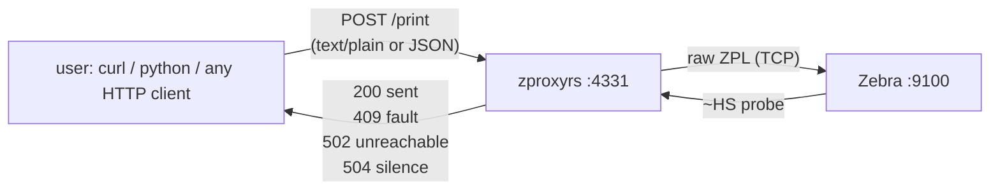

# zproxyrs

Agnostic HTTP → raw-TCP print proxy for Zebra ZPL printers.

Users just `POST` a message. The bridge forwards untouched bytes over TCP `:9100`
and reports back real printer truth via a `~HS` status probe — no printer
drivers, no SDK, no client-side TCP needed.



## Features

- **Agnostic input** — `text/plain`, `application/octet-stream`, or JSON
  envelope (`zpl` | `message` | `data` | `payload` | `text`, or bare `"..."` string).
- **Verified delivery** — post-print `~HS` query parses paper/ribbon/head/pause/
  temperature/buffer state. No more silent `200`.
- **Truthful status codes** — `200`, `400`, `409`, `413`, `502`, `504`
  (see table below).
- **Status probe without printing** — `GET /status`.
- **Fast path** — `POST /print?verify=false` skips `~HS` (200 = bytes written).
- **OpenAPI docs** — Swagger UI at `/docs`, spec at `/api-docs/openapi.json`.
- **Structured JSON logs** — every request logs content-type, length, target,
  `~HS` outcome, and a 120-char preview.

## Quickstart

```bash
cp .env.example .env
# edit .env → ZPL_IP=<printer-ip> ZPL_PORT=9100

cargo run
# starting zproxyrs printer="192.168.19.5:9100" bind="127.0.0.1:4331" docs="/docs"
```

Print a label:

```bash
curl -X POST http://127.0.0.1:4331/print \
  -H 'Content-Type: text/plain' \
  --data-binary '^XA^FO20,20^A0N,40,40^FDTEST123^FS^XZ'
# {"status":"sent","bytes":37,"printer":"192.168.19.5:9100",
#  "printer_status":{...},"warnings":[]}

curl -s http://127.0.0.1:4331/status | jq .
curl -s http://127.0.0.1:4331/health
```

Python sender (stdlib only):

```bash
python3 tests/send_print.py example_txt.txt
python3 tests/send_print.py example_txt.txt --json
python3 tests/send_print.py --status
python3 tests/send_print.py example_txt.txt --no-verify
```

Docs:

- UI: `http://127.0.0.1:4331/docs`
- JSON: `http://127.0.0.1:4331/api-docs/openapi.json`
- REST client file: [`example_zpl.http`](example_zpl.http)

## Configuration

| Var           | Default     | Description                  |
| ------------- | ----------- | ---------------------------- |
| `ZPL_IP`      | `127.0.0.1` | Printer IP / hostname        |
| `ZPL_PORT`    | `9100`      | Raw-TCP print port           |
| `SERVER_HOST` | `127.0.0.1` | Bridge bind host             |
| `SERVER_PORT` | `4331`      | Bridge bind port             |
| `RUST_LOG`    | `info`      | `tracing` filter             |

A minimal `.env` loader is built in (real environment always wins).

## API

### `POST /print`

Push raw ZPL to the printer (verified by default).

Query: `?verify=true|false` (default `true`).

| Code | Meaning |
| ---- | ------- |
| `200` | `sent` — bytes written + printer ready (or `sent_with_warnings` with `warnings[]`) |
| `400` | Empty body / invalid JSON envelope |
| `409` | `printer_error` — bytes written but `~HS` reports fault (`paper_out`, `ribbon_out`, `head_up`, `paused`, …) |
| `413` | Body exceeds 1 MiB |
| `502` | Printer unreachable / write / probe-connect failed |
| `504` | `printer_status_unknown` — `~HS` silence (Zebra suppresses reply on ribbon-out / over-temp / rewinder-full) or io timeout |

Success shape:

```json
{
  "status": "sent",
  "bytes": 37,
  "printer": "192.168.19.5:9100",
  "printer_status": { "paper_out": false, "paused": false, "...": "..." },
  "warnings": []
}
```

Error shape:

```json
{
  "status": "printer_error",
  "error": "printer reports fault: paper_out",
  "printer": "192.168.19.5:9100",
  "printer_status": { "...": "..." }
}
```

### `GET /status`

Probe only (no print). `200` = probe answered — inspect `ready`/`faults`.
`502`/`504` = probe failed (same mapping as above).

```json
{
  "printer": "192.168.19.5:9100",
  "reachable": true,
  "ready": false,
  "faults": ["paper_out"],
  "status": { "...": "..." }
}
```

### `GET /health`

```json
{ "status": "ok", "service": "zproxyrs" }
```

## How verification works

Raw `:9100` printing is fire-and-forget — a successful TCP write does **not**
mean the label printed. After each write (unless `?verify=false`), the bridge
opens a second connection, sends `~HS\r\n`, reads the 3-line reply
(`STX…ETX` tolerant), and parses per Zebra docs (`~HS` + SGD
`device.host_status`):

- Line 1 `aaa,b,c,dddd,eee,f,g,h,iii,j,k,l` → paper-out, pause, buffer, RAM, temp
- Line 2 `mmm,n,o,p,q,r,s,t,uuuuuuuu,v,www` → head-up, ribbon-out, label-waiting, remaining
- Line 3 `xxxx,y` → kept in `raw` for debugging

Silence after a successful write is itself a signal (critical faults suppress
`~HS`) and maps to `504`.

## Architecture

```
src/
  main.rs      wiring only (.env, tracing, bind, serve with docs)
  lib.rs       library root (tests/ import here)
  constants.rs numeric knobs + canonical strings (no literals elsewhere)
  enums.rs     EnvKey / Route / JsonField / LogEvent / PrintOutcome
               + trait EnumStr + generic StrFactory
  config.rs    trait ConfigLoader + EnvConfigLoader + generic ConfigFactory
  printer.rs   trait PrinterSender (TcpZplPrinter) + generic send_payload
               + StatusProber impl (~HS round-trip)
  status.rs    PrinterStatus / PrinterFault / StatusFactory::parse
  routes.rs    RouterFactory (+with_docs), handlers, generic extract_payload
  docs.rs      utoipa ApiDoc + DocsFactory
tests/
  print_unit.rs  standalone unit tests (no printer needed)
  user_sender.rs Rust sender: fake printer (capture + ~HS reply) + raw-TCP POST
  send_print.py  Python sender (urllib stdlib): print / --json / --status / --no-verify
```

Patterns: factory + generic fn + trait throughout, `match`-driven branching,
enums over stringly-typed code, unit tests outside `src/`.

## Development

```bash
cargo fmt
cargo test        # 26 unit + 3 sender e2e (fake printer, no hardware)
cargo build
```

Pre-flight without hardware:

```bash
printf '^XA^FO20,20^A0N,40,40^FDTEST123^FS^XZ' | nc -w 5 <printer-ip> 9100
```

Note: ZPL has no `//` comments — use `^FX…^FS`. Strip template placeholders
(`{{ … }}`) before sending unless your upstream renders them first.

## Stack

- `axum 0.8` + `tokio full` — HTTP + raw TCP
- `serde / serde_json` — agnostic body handling
- `tracing + tracing-subscriber (json, env-filter)` — structured logs
- `utoipa 5 + utoipa-axum 0.2 + utoipa-swagger-ui 9` — OpenAPI 3 / Swagger UI

## License

MIT License — see [LICENSE](LICENSE) for details.
